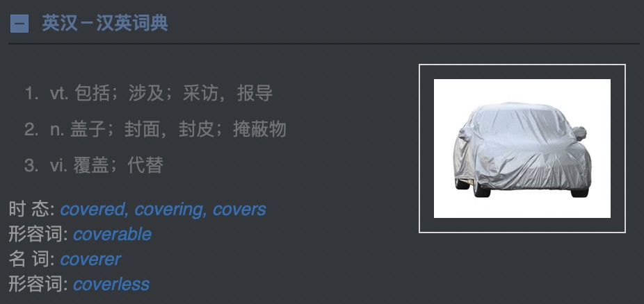
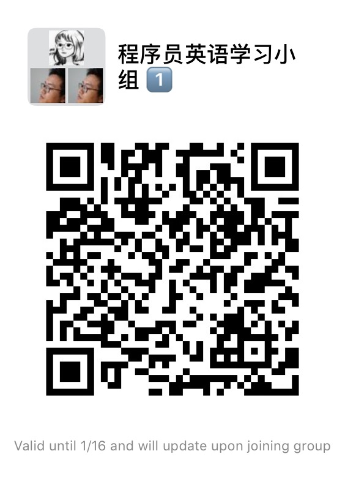

# An-English-Guide-for-Programmers

专为程序员编写的英语学习指南。

> 预警：本指南可能会花费你大量时间阅读，建议通过周六上午整块的时间一次性读完，并在下午制定自己的学习策略，然后在周日开始实践一下。

## 目录

* 本指南的内容概要和目标人群
* 语言的本质浅析
* 如何构建一个识别英语的程序
* 我的训练方法
* 常见问题 QA
* 资料推荐和扩展阅读
* 总结

## 本指南的内容概要和目标人群

本人上一次正式英语考试大约是五年前大学四级考试，得分 442，大学每学期考试基本是 60 多分过线就好，纯属英语渣底子很差。但是由于一些特殊需求，雅思需要考到 6.5 分及以上，所以自 2018 年 6 月份开始一直在学习英语。在学习过程中，对语言学习从陌生到熟悉，从毫无头绪到了解一些实用的训练方法，从乱看经验经常换方法到总结出自己的学习方法。

经过四个月断续学习 + 接近两个月的全职突击备考，考了 PTE 考试（类似雅思的英语水平测试）并拿到 63 分，对应雅思 6.5 中上，满足大部分学校留学要求以及出国技术移民的要求。备考过程十分艰苦，个人感觉远超高考。虽然离十分流畅的跟 Native Speaker 交流还有一段距离，但是相比四级 442 的水平有了几倍的提升。故此编写教程进行阶段性总结，一来方便自己制定下一步训练计划，二来希望可以对同等水平有需求的朋友有所帮助。

本教程目标人群是**想要花一些时间真正掌握英语的人**，尤其适合英语渣。对于英语渣来说，网上杂七杂八的英语学习技巧和经验不一定会有很多帮助，甚至会误导。比如[这篇回答](https://www.zhihu.com/question/22968875/answer/529514279)就说了，如果别人问答主如何学英语，她顶多给一句“多看美剧，培养语感”，好在这篇回答详细说了答主的水平和长期的努力细节，否则会误导一大片低水平英语渣去拼命的看美剧。所以**在英语学习过程中，要注意查看符合自己水平的经验和教程**，否则可能会走弯路。

如果你在寻找《21 天掌握英语》、《10 天背会 1000 词》、《10 天搞定英语写作》之类的资料，这份指南并不适合你。尤其是语言学习，学习周期都是以月或者年来计的，**你越早明白语言学习没有技巧，就会越少浪费时间和金钱在各种资料和经验上面，走越少的弯路**。

由于网上各种英语学习技巧的效果跟学习者的水平相关，所以**本指南会深挖语言的本质（主要用中文举例）并用程序员易于理解的方式去思考，并提供自己根据本质推演出来的训练方法和经验做参考。重中之重是你要根据本质自己设计适合自己的训练方法。**

需要补充的是，由于本人的水平有限而且也在持续学习，后续会经常完善、升级、更新本指南，**强烈建议 Watch 并时而回来看看**。因此如果转载本指南，请保留出处避免信息过时。如有异议或者建议，也十分欢迎在 Issue 中讨论。还需要注意的是，由于本文是文本形式，不好播放声音，所以用中文来描述一些单词的错误发音，在日常英语学习中应该使用音标而不能使用中文标注发音。

## 语言的本质浅析

语言的本质功能是人与人或物体之间的意识、知识的交换，它是几种方法中最高效和具备扩展性的方法，但并不是唯一方法。

```
比如：
1. 在国外旅行，当地语言可能不会，但不会饿死。点餐的时候可以用 this 大法或者手指指菜，当然也可以打开大众点评之类的，给服务员展示图片下单。
2. 看一本俄语、韩语、日本语的 JavaScript 书籍时，你可能不懂上下文是什么意思，但你看到中间的 JavaScript 示例代码，就明白上面可能讲的是什么东西。
3. 一个外国人表情愤怒、语速飞快、声音大声，即便你听不懂他在说什么，但你可以明白他现在很愤怒，可能在骂人。
```

从上面的案例你可以看到，即便你不懂语言，也可以交换意见，只是掌握语言之后，你可以更精准、更快、更容易的交流、交换、表达。

通过语言的本质，我们可以知道：

* 语言只是一种表达方式，作为媒介将人的意识意念传递给其他人或物体，因此可以推导出：
  * -> 脑子好使但语言表达不行，在别人看来等于脑子不行
  * -> **语言受限于表达能力，对意识传递是有损的，尤其是翻译**，损失更大（所以翻译的最高要求 信达雅 其实对翻译者要求非常高，要先理解转换为自己意识，再用另一门语言精准表达意识）

基于上面我们可以进一步推导出：

* **语言的学习，是学习双方都能理解的表达方式和表达思维。** 比如：apple 对于你是苹果，对于对方也是苹果；英文的思维习惯是从细节到具体（地址先说门牌号最后是国家，日期先说天最后是年份）而中文思维习惯是从大到小。
* **语言的表达不能通过转换为自己熟悉的语言再转换。** 比如：在实际交流中，你不能将一段英语翻译成中文，理解了意思再想出中文，再翻译成英文表达出去。一是信息有损，二是思考的过程太慢影响交流的时效性。实际上有些英文句子只可意会不可翻译，所以很多熟悉两门语言的人会常常混用表达。

## 如何构建一个识别英语的程序

现在我们不讨论你如何学英语，而是**让你构建一个可以识别、交流英语的程序，你会如何设计？**

### 简单的需求分析

以中文为例，当你听到一个女人对一个男人说：“你是一个男人吗？”时，你会收集到哪些信息？你需要哪些信息来明确这个女人想表达的确切意思？

首先是听力输入，你需要确保麦克风录入了音频，然后拿到的声波内容是 U*#@&*!&*&*。之后我们需要将声波内容输入到一大堆分析器中进行分析，并得到比较精准的意图。

第一个可能是性别分析器，通过一定的规则识别出这是一个男性的声音还是女性的声音。因为这句话是男的说出来还是女的说出来表达的意思是不一样的。

第二个就是内容识别器，先是加载粤语匹配引擎和粤语语料库发现声波无法匹配解析，那么换成普通话引擎和语料库。此时如果你的物料库里有“你”、“是”、“一个”、“男人”、“吗”这些录音素材，那么就可以匹配解析出这句话：“你是一个男人吗？”。换言之，如果你没有粤语语料库和解析引擎，即便是给你一段粤语录音你也听不懂。如果这句话有一个生僻单词你语料库里没有，那么也是无法识别出来。

之后还有更多识别器，比如年龄、情绪识别器、重音和疑问语气识别句等，这些因素共同决定了这句话究竟想要传达什么意思。如果是一个女性的激动等感叹语气“你是一个男人吗！”，那么可以推测出这个女的跟男的有一定的关系，这个男的做出了一些伤天害理的事情导致这个女性在质问。如果是一个轻声细语的疑问句“你是一个男人吗？”，可能是一名女性想确认对方的性别。当然更准确表达这个意图的句子应该是“你是男性吗？”。

### 比较基础的方案设计

上面需求分析只是简单的介绍了 `声音 -> 听力识别器 -> 意图` 的过程，实际上**语言交流是听说读写，其中包含两个识别器（听力识别器和视力识别器），一个核心理解器，两个表达器（口语表达器和书写表达器）**。通过对应的实际场景，我们可以简单的梳理出对应需要的功能。

#### 听力识别器

* **听力能力**
  * 说明：要求可以输入声音并转换成一种可分析的信号。
  * 训练：买个好麦克风，对应人类是保护好耳朵和听力。
* **口音识别器**
  * 说明：各类方言比如粤语，各种口音比如东北口音、广东口音、英式发音和美式发音。
* **语言特性识别器**
  * 说明：语言之间会有不同特性，比如中文没有略读，都是一个一个字念出来，而英文会为了说话省劲而略读或者连读，比如“drink it”并不是单个蹦的“准克一特”，而是类似“准kei特”。中文的“喝它”就是“喝它”，不会有类似“赫特”之类的变化。
  * 训练：扩充特殊语言引擎的匹配规则，扩充语料库，当听到“准kei特”可以识别出是“drink it”。
* 音量调节和杂音处理器
  * 说明：可以通过算法过滤无用杂音，并将小音量调大使其清晰。人类天然进化出这种能力，无需特殊训练。
* 语气、性别、身份、语速识别器
  * 说明：人类天然进化出这种能力，无需特殊训练。
* 上下文缓存器
  * 说明：交流过程要有上下文内容缓存，结合输入理解器。


#### 视力识别器

* 视力能力
* 图形识别器
  * 说明：不同字体、变形（英文大小写、中文繁简体等）都可以识别出来具体字符，同时需要识别标点符号等输入理解器。
  * 训练：识别能力、精准度和速度。比如一眼看出 `message` 和 `massage` 是不一样的。
* 上下文缓存器

#### 理解器

理解器可以说是最重要的部分了，也是最难的部分

* **语料库**
  * 说明：字母、单词、发音、多重语境含义、历史文化背景、不同形态，同义词反义词相近词。
  * 训练：需要长期积累和扩充，需要大量训练。
* **识别引擎**
  * 说明：单词拼装起来的句型句式、语法、时态含义和规则、标点符号、单复数、惯用表达、俚语。
  * 训练：单点突破，专项训练，逐步体系化积累。
* **思考和思维能力**
  * 说明：针对意图结合之前的记忆以及经验得出自己想要表达的意图。
  * 训练：结构性表达，思维能力锻炼，思考和总结能力。这个与语言无关。
* 上下文缓存器

#### 口语表达器

当理解器思考运算并得到想要表达的意图之后，就需要开始表达传递出去。

* **意图语料组装器**
  * 说明：将意图结合语料中的单词、句型句式、惯用表达进行匹配组合，挑选出最符合你意图的语句。
* **发音器**
  * 说明：根据组装出来的内容，结合特殊的连读、略读等语言特性，转换成发声信号。对应人类的话是**控制舌头、声带和呼吸系统的肌肉使其变成对应形状，让气流通过声带发出对应声音。**

#### 书写表达器

* 意图语料组装器
* 书写表达器
  * 说明：将语料组装结果以视觉的方式表达，对于人类是控制手部肌肉书写出对应形状。

从上面可以看出，口语听力相对于阅读写作更加困难，主要因为实时性的要求。你必须迅速反馈不经过思考，这要求**你要无意识的去用英语表达**，所以语言学习没有技巧，只有大量训练。

## 我的训练方法

受限于篇幅，这里我只提供部分我觉得比较重要、有效的方法，并在 QA 部分会对常见能力的误区做一些解答。

### 在训练之前

#### 做好 Benchmark 并设置目标

**无论是做性能优化还是做什么事情，第一件事肯定是先做当前状态的记录，并设置一个目标和期限。**

对于英语，你可以测试当前词汇量，并对词汇量有一个目标；也可以设置目标为流畅的看技术大会视频，能听懂 90% 的内容。 **我更建议通过雅思、托福或者 PTE 这种专业英语水平考试来做目标。** 一方面这种专业考试是听说读写全方位测试你的英语能力，相比其他测试更加客观一些而且能体现你的短板。另一方面就是如果出国留学或者工作，也可以作为你英语能力的证明。当然缺点就是要备考，然后考一次差不多 2k 块钱。相比其他考试，我更推荐 PTE，[可以点击查看为什么](./WhyPTE.md)。

没做 Benchmark 是我备考期间最后悔的一件事情。上一次测试还是大学四级，由于程序员必须掌握一定的英语，所以在日常工作中我非常注重英语训练：手机和电脑系统设置全英文、搜索问题用英文、英文技术视频能看懂一半、经常阅读英文技术文档、时间日记用英文、commit messages 全部英文、刷完多邻国的英语教程、刷完赖世雄的《发音从头学》以及坚持了一段时间流利说的懂你英语课程。这些操作都给了我主观的自信，所以刚开始我认为只要给我一个半月就可以搞定雅思了，结果闭关学了一个半月，连真题的题目要求都看不懂。再搜搜网上经验，连留学生都得复习 2-4 个月。才慢慢的意识到前面的尝试，就像用 Dreamweaver 或者乱七八糟的代码拼凑做网页一样，倒也可以满足一些需求，但在专业前端工程师（专业英语考试）面前，都是渣渣。

#### 抱着怀疑、认真严谨的态度

这并不只是学习英语需要的态度，但是在学习英语的过程中，我感受颇深。**看到一个老师说的或者网上的知识，第一反应要去质疑跟自己的知识进行对比，确定无误后再吸收。**

曾经上过沪江网校的单词课，授课老师是专业英语培训又留过学考试成绩也好，但还是有个别单词读错了，比如 resident 的 s 读了 s 的音，但其实是 z 的音，所以就[反馈给助教](./assets/resident.png)了。通常来说国外英语老师犯错的概率肯定比国内英语老师的低，但也不能保证全对，比如之前我发现了 [Magoosh 一个卡片的奇怪单词](./assets/spreate.jpg)，反馈之后[的确是拼错了](./assets/spread.jpg)。还有 Youtube 上一个[高赞的音标发音示范教程](https://www.youtube.com/watch?v=n4NVPg2kHv4)，又是美女还有嘴形视频非常好了，但是到了[清辅音这里](https://www.youtube.com/watch?v=n4NVPg2kHv4&t=370s)，在 p、t 和 ʧ 的发音明显听到了有个呃的声音，喉咙明显震动了。。。果断弃之。

### 扩充语料库的训练方法

经过上面分析，可以得出英语学习最关键的内容就是**语料库**，其次就是语法（识别引擎）。

**语料库并不只是词汇，训练学习方法也并非简单的背单词。**

如果通过听力识别器输入语料，首先我们要能**区分口音**，比如这个语料等英式发音、美式发音、澳洲发音、印度发音等是什么样等。之后就是一些**连读、弱读和重音变化规则**。通过口音、连读和重音等规则正确解析得到词句短语之后，开始**进入解析器流程**。我们需要知道其中**每个单词的多重含义**，将其含义一个个的匹配放入上下文语境结合重音等得到最准确的含义。这时还可能遇到一些词典里没有的**新词或者老词新意**，比如“给力”、“呵呵”或者各种歪曲解释的“不可描述”的成语等，这些都是人们新造或者赋予了新意思的词，这些词意词典并不一定会收录，但广泛在一个圈子里使用和交流，这就涉及到文化、俚语、流行语等。此外**还需要用语法进行下一步解析**，比如时态、标点、语气、句型句式等。

经过上面流程才可以解析出比较准确的意思，**做出回应还要逆向再来一遍**。

首先你要**梳理好你想表达的意图**，按照一定逻辑来整理。这一步其实跟语言无关，中文阅读理解能力好的人，英文只要看懂了阅读理解能力也会很强，有条理的人不只是说话有条理，做事情也会很有条理和逻辑性。想好表达之后你就要开始**从语料库抽取最符合你意图的词句**，并按照合适的语法进行组装，这时候就可以看出一个人语料库大小和水平。比如表达我喜欢一个梳妆台，只有最基础语料库的我只能说出：我喜欢这个桌子上有镜子的东西。这时，看到这句话的人可能知道你想表达喜爱一张桌子和镜子的东西，但不知道具体是什么。如果语料库里有更庞大的名词库和程度形容词，就可以说出：这就是我梦寐以求的带有地中海风格雕刻、椭圆梳妆镜的梳妆台。看到这句话你脑子里应该可以出现这个梳妆台大体的样子吧。之后，你**还需要发音说出来**，先从语料库里抽取对应的词句声音，再结合略读、弱读、重读等规则控制舌头、喉咙肌肉发出来对应的声音，至此算是完成一次对话。

上面只是听力识别器，视力识别器大同小异，无非是识别各种字体、大小写、标点符号等，不再赘述。

**通过上面分析可以得知，语料库里的每个语料都需要以下信息：**

* **多种口音的声音**，比如：英美澳印等。
* **不同词性和时态下，不同的发音和重音位置变化**，比如：`resume` 在名词下表简历，发音 [/ˈrez.ə.meɪ/](https://dictionary.cambridge.org/media/english/us_pron/e/eus/eus73/eus73812.mp3)，而动词表继续之前暂停的事情，发音 [/rɪˈzuːm/](https://dictionary.cambridge.org/media/english/us_pron/e/eus/eus73/eus73965.mp3)，如果你发错了声音，则会导致对方解读错误。
* **单词的多重含义**，比如：`current` 常见意思是形容词当下的，但实际上还有名词的水流、潮流等意思。曾经做阅读理解看到带有水流意思的句子一脸懵逼，没法用“当下”的意思来解释和理解这个句子。同样 `spring` 除了春天还有弹力、泉水等完全联想不到的意思。
* **同义词及其对比、反义词等**，因为你的回复可能需要否决或者加强观点，这些词可以帮助你更好更精准的表达。比如： `raise` 和 `rise` 有什么区别，什么场景下适用？还有 `under`、`beneath`、`underneath` 和 `below` 等，要怎么用。
* **语料相关的俚语、文化、衍生词等**。比如：`clump` 这个单词本意是草丛之类的意思，但是你可以搜下 Google 图片，[形容词 clumped 还算正常]((./assets/clump.jpg))，但名词搜出来[完全变成了一种奇怪的生物](./assets/clump.jpg)。因为这个单词正好是两个热门美国人物名字合起来的发音，所以老美虚构了一个人出来调侃。因此如果看到 twitter 上有这个单词，要多考虑下是不是在调侃政治人物。
* **相关的常见固定搭配和用法**。比如：`focus to` 和 `pay attention on` 区别以及介词的不同。
* **名词的单复数形态和动词的各种时态变形及其发音规则**。比如：`hair` 在不同词性下既可数又不可数，反过来说，也可以通过这个判断出此处 `hair` 要表达的意思。`s` 结尾通常有 `z` 和 `s` 两个发音，`ed` 结尾也有 `d`、`t` 以及 `td` 等情况。`read` 更奇葩，过去式和过去分词还是 `read`，但是发音相比原形变了，读作 `/red/`，换言之，需要通过这个发音来识别这个行为是过去发生的还是现在。

除了语料之外的语法，就靠单点专项突破，比如时态种类和规则、词性和句子组成结构以及时间和数字的组合规则和发音方法等等。这里不再赘述。

#### 扩充语料库的训练方法实战

例如看到一个 `clump` 单词想要学习，可以这样做：

1. 第一遍开始认识单词：
  * 通过 [Cambridge Dictionary](https://dictionary.cambridge.org/dictionary/english/clump) 查询单词意思，可以看到是否可数、各种**释义和对应的例句**、关联词和对比等等。[Merriam Webster](https://www.merriam-webster.com/dictionary/clump) 是美式在线字典，如有精力也可以作为知识补充，但是例句和界面不如 Cambridge Dictionary 好用。
  * 查看音标，尝试发音（需要先把音标练熟，参照下面内容），收听词典给出的英式和美式发音，看下自己的发音是否准确？哪里不对？是音标还是重音？练对为止。
  * 打开 [Forvo](https://forvo.com/word/clump/#en) 收听这个单词不同人的发音，可以尝试跟读以便录入自己的语料库。
  * 打开 [Google Translate](https://translate.google.as/) 语音输入，尽量带上耳机或者用耳麦尝试发音，查看是否能稳定识别出当前单词。如果不能，请回到第 2 个步骤，对 Google Translate 播放母语音频查看能否识别。如果可以识别，请重复第 2 个步骤训练到可以识别为止。
  * 打开 Google 搜索，[输入当前单词 + vs 即可看到近义词和易混淆词汇](./assets/clump-google.jpg)。搜索查看相关解释。
  * 非特别抽象的单词，可以打开 Google 图片搜索进行搜索，通过图像加深记忆。比如搜索 clump 时，了解到居然是[两位候选人的合体](./assets/clump.jpg)。再举一个例子，`bay` 和 `gulf` 在词典里都有海湾的意思，那它们之间有什么区别吗？用 Google 图片搜索一下你就可以发现，[`gulf` 要比 `bay` 大的多](./assets/gulf-bay.jpg)。
  * 将单词以及有趣的发现记录在 [Anki](https://apps.ankiweb.net/) 里面，[只需要点击 Add 并添加单词即可，也可以在下方多加一些注释](./assets/add-to-anki.jpg)，可繁可简不需要花太多时间。将在后面的 QA 部分解释为什么要用 Anki。
2. 第二遍在 Anki 里面复习，看到单词尝试发音识别，尝试回忆相关的意思、用法以及图像，尽可能的回忆。如果感觉没问题那么就点击 Good 或者 Easy，否则就选择 Again 或者 Hard。如果掌握不好，请重复第一遍步骤加深记忆。
3. 第三遍重复第二步。
4. 第 N 遍，已经基本掌握。

每隔一段时间应该导出一份单词列表，放在 [Danci88](http://www.danci88.com) 上面进行听写。这个工具虽然比较简陋，但是非常实用。通过听写可以看出对这个单词的掌握程度，如果你脑子瞬间出现这个单词则表示掌握了。

**值得注意的是，上面步骤是相对完整的学习步骤，在实际学习过程中针对不同类别的单词应该可繁可简**。比如我在 Anki 建立了 7 个语料库，分别是：

* **发音错题本**：第一眼看到单词发出的声音无法识别或者与实际发音不符。这类单词要注重音标、发音识别、多语音辨音等，要用 Google 翻译来识别测试。
* **听力单词本**：在听写或者听力时，没有听出并写出的词句。这类单词要注重发音和听写训练。
* **常见名词本**：例如国家、地区等。这类单词只需注重发音和听力即可，常见单词注重拼写以及了解相关文化历史，不常见甚至不需要去学怎么拼写。
* **拼写错题本**：这类单词认识意思、会读，但是拼写错了。其实很多常见的单词，都觉得习以为常，但真正让你拼写的时候却拿捏不准。这类单词就要注重拼写，以及多在键盘上敲打建立肌肉记忆。
* **新单词本**：这个就是遇到的比较重要的新单词，需要按照上面流程进行学习。这类单词就是重复刷记忆。
* **熟词生僻意思单词本**：这个主要记录一些很熟悉的词的生僻意思。比如 `champion` 比较常见的是名词冠军，但其实也有动词捍卫的生僻意思。
* **连读训练本**：这个是在练习口语阅读或者复述句子时，觉得很绕口的词句。比如 `the very idea of a police force was seen as foreign as that is` 这句话。这类语料要注重断句、重读、声调变化和气息控制，重复读到流畅即可。

上面步骤好像很多，而且需要记忆的内容量好大，有什么技巧来快速稳定的记忆吗？

#### 记忆单词、语料库唯一的银弹：重复训练

时间回到初中，我英语不是很好，路上遇到同行英语老师便问道学习英语有什么技巧吗？老师微笑说：**Practice、Practice and Practice**，我却不以为然，这应该是我走过的最大的弯路。

高中之后，为了提升记忆力，我做了很多尝试和训练。比如七田真的《超右脑照相记忆法》以及《魔术记忆》等，经常对着曼陀罗图片看、上学放学路上眨眼记车牌、瞬间记住一串手机号以及按照《魔术记忆》的联想技巧记忆一些东西，希望能练到过目不忘。看起来是挺神奇挺有效的，尤其是《魔术记忆》里面的“联想记忆法”、“定桩记忆法”、“记忆宫殿记忆法”等，随便一个人都可以快速记忆一串不相关的关键词。

正是如此，**这类英语学习速记技巧也成了各种网上学习平台割韭菜的视频教程**，还卖价不菲。通过几个单词联想让试看的观众觉得神奇，从而脑热买下教程，大部分人买了不看，即使看了练了也没啥用。

作为过来人回头来看，这完全是弯路，这些**速记方法大多是表演性质的，根本没法固化成自己的能力**。请你回忆一下，你为什么认识 `commit` 这个单词？是因为通过什么其他单词联想出来的吗？是因为通过某个图片关联想起来的吗？并不是，当你用 git 提交时，你几乎天天都遇到这个单词，同事天天交流用这个单词，正是一遍遍的在你面前出现、听到才让你非常熟练的掌握这个单词。如果你不认识 `commit` 这个单词，那么说说你是怎么记住你的那么长的身份证号码的？是通过对数字图像化、故事化编排的？还是大量重复见到和用到？

**你越早明白语言学习没有技巧，就会走越少的弯路、花越少的冤枉钱。**——这是我走过 13 年的弯路近期得出的结论。

通过重复训练得到的能力还会更持久，就像你的 QQ 号，即便过了这么多年没用应该还可以熟练的背出来吧。这也是为什么要用 Anki 的原因，具体介绍详见 QA 章节。

### 发音和听力训练方法

发音和听力是相辅相成的，都是需要使用语料库的声音素材。**所以练发音的时候，能发出某种特殊的声音，也能让你听力能分辨出来；反之，先能分辨出某种声音，你才能模仿发出来。**

#### 音标要反复刷，刷到熟练、准确为止

**【音标时候语音识别的最小识别单位，用于建立最基础的语音语料库】**

我在这里踩了坑。在我学会打字之前一直不会拼音，但也正常掌握中文发音。所以在上英语课时不懂音标就算了觉得跟中文一样肯定没问题，但其实这走了一个很大的弯路。

[郭杰瑞的《美国人学英语竟然不学音标！为啥中国人要学？》](https://www.bilibili.com/video/av29899416/) 很好的解释了这个问题。简单的说 Native Speaker 生活在这个语言环境下，模仿别人的声音，也不断的被纠正这个声音，又有大量的输入自然会很准。但对于中国人来说显然有问题，你模仿的这个人的发音可能就是错的，也没有人给你纠正，甚至你的错误发音会误导其他人。

即便是在阿里巴巴工作的时候，也时常遇到这种情况。比如 Button 这个高频简单的词汇，一直念“巴特嗯”，但是一同事念“波特嗯”好奇怪，搜了下发音不知道搜了哪国口音，声音听起来的确像是“波特嗯”，之后我也一直念“波特恩”。直到我学会了音标才能十分确定这个单词的真正发音就是类似“巴特嗯”。举这个例子是想说，**只有音标才是一个单词最精确的发音**，涉及到口音以及发音者水平等等因素，你不确定听到的发音是绝对正确的，只有看到音标你才能确定。

之前在阿里工作时用到 [Fusion（现已开源）](https://fusion.design/)，这个单词我在阿里听到了至少十个版本的发音，印象中没有一个是对的。原因很简单，这个单词里有个比较“难发”的音 `ʒ`。之所以难发，是因为在汉语中没有这种声音，我们从来没练过发出这种声音，所以不经过训练，口腔肌肉和气息很难发出这个声音导致单词发错音。可以[在 forvo 上面听听多位老外录的发音](https://forvo.com/word/fusion/#en)，可以看到下面仍然有两个奇怪的声音，如果不知道音标模仿这俩声音那就非常悲剧了。当然最准确的还是 [Cambridge Dictionary](https://dictionary.cambridge.org/dictionary/english/fusion) 上面的发音，权威、专业且准确。所以**训练音标最重要的目的是补充你之前发不出的声音，并且可以辨音。**

具体训练过程，我先按照网上推荐用了赖世雄的《发音从头学》，不同时间跟着教程刷过三遍，原以为没问题了结果发现还是不行，而且音标是个很奇怪的东西，美式和英式符号有所不同。而这本书主要是美式，网上经常搜出英式音标，所以时常懵逼。这里我推荐直接在 Youtube 上找 IPA 视频来刷，比如 [International Phonetic Alphabet (IPA) | English Pronunciation](https://www.youtube.com/watch?v=o8KppNXfx2k) 这个是我见过最好的 IPA 发音教程，附带了赖世雄书里没有的基础规则和英美对比。但仍然有部分单词的美式发音不够准确，所以还要推荐一个 [48个音标的标准美式发音](https://www.bilibili.com/video/av33138814/) 配合来看，这个的好处是有嘴形可以模仿，**发音的关键就是嘴形、舌头位置、气息相互配合产生声音**，有些声音无法发到位的原因就是嘴形、舌头等不到位。例如 three 的咬舌音 θ，如果你舌尖没放到牙上吐气，就是发不出来。

#### 通过 Google 翻译识别纠音

**【正确的发音是正常、准确交流的前提，语料库里的素材也需要保证正确，纠音是积累语料库中非常关键的一步。】**

当我觉得准备差不多了的时候，进行了一次 PTE 模考，结果超出我的想象。发音和口语流利度居然是 0 分，这意味着我 PTE 测评程序认为我说的不是英语，有超过一半的语音无法识别对。我突然就想到了在新西兰旅游的时候，我对着 Airbnb 的房东说一个很简单的句子，她都会愣一下然后反应过来。所以我到底说的是什么？

所以我在淘宝上找到了 1v1 的纠音课，才发现有大量很基础的单词都读错了。比如 `school` 直接读 `四顾` ，漏了 `l` 的音，其实类似 `四顾奥`，同样的 `idea` 读成了 `爱第也饿`，其实没有卷舌音。

人肉纠音显然不适合大量训练，一是贵，二是反馈慢不能实时反馈，三是有些问题可能还是发现不了。由于 PTE 是语音识别，机器打分。我很快就想到了用 Siri 来识别我说的东西准不准，但其实 Siri 是偏日常化的口语模型，面对复杂单词等会强行转换成日常对话并不合适。Google 翻译便成了最佳选择。

**Google 翻译有足够的技术和训练素材来做语音识别引擎**，由于是翻译，会尽可能原汁原味的解析。如果质疑它的准确度，你可以读一段中文让它识别，或者播放一段清晰的英文语音试试看。

在意识到自己发音问题很严重时，我开始了艰难的纠音过程。**方法很简单，就是找个带耳麦的耳机或者麦克风（务必要用外置声音输入设备，否则识别可能不准），打开 <https://translate.google.as/>（之所以打开 as 是因为这个域名下面会默认启用美式发音、识别引擎）[并点击下面麦克风 Icon 开始说](./assets/google-translate.jpg)，查看是否识别。**

可以说单个单词，也可以说一个句子。我先从句子开始，说一句话看看是否识别，找到识别错的单词进行训练再回头读句子。为了节约时间，一个句子 80% 可以识别就算可以过了。

刚开始特别艰难，我发现连 `these` 这种最常见最简单的单词我都读错了识别不出来，本质问题首先是 `ð` 和 `z` 这俩音标本身发音不准，其次是这俩连起来在一个单词中快速读的时候，舌头肌肉转不过来。所以纠音第一天上午练了一个半小时的 `these` 直到基本可以识别出来。当时挺绝望的，感觉这种纠音方式得纠到什么时候。其实后面越来越快，表面上你只纠音了 `these` 这一个单词，其实你把所有带 `ð` 和 `z` 的单词都练过了，后面就快多了。

纠音经验总结：

* **发音训练时务必要有纠音。**最好是人，最差是 Google 翻译语音识别。在没有纠音之前，**很多发音发错了自己是察觉不到的**，即便是自己音标很熟悉也有可能在组合起来的时候出错。**如果出错没人纠正自以为正确继续训练，还不如不练，后期更难纠音。**
* **大量训练。**在这个过程中可以明显感觉到，单个音标读准读对，并不意味着组合起来的单词就可以读对，同样单个单词可以发音很准，并不意味着在读一个句子的时候这个单词可以读的准。都需要大量训练才可以。

#### 通过 Youtube 学习

**【Youtube 的海量高质量学习资源，是建立语料库的非常好的素材】**

Youtube 简直是学习利器。上面有无数的英语讲师录制视频教外国人学英语，同时视频本身用的是比较简单比较慢速的英语，可以顺便练习听力。

比如连读 H 省略的教程 [How to Link: words that begin with H - American English Pronunciation](https://www.youtube.com/watch?v=QuOw_KnFk3Y)，关于英语重音的教程 [Word Stress in English | How to Pronounce...](https://www.youtube.com/watch?v=efNSXTGkAsE)，-ed 结尾的发音规则 [How to say -ed endings in English](https://www.youtube.com/watch?v=YWuS7rfZlDQ)、s 结尾的发音规则 [How to pronounce words ending in S](https://www.youtube.com/watch?v=BU6FoC9Rzyg) 和 ex 前缀的发音规则 [3 ways to pronounce the EX sound in English](https://www.youtube.com/watch?v=ef5zvdQwRLw)。太多太多优质教程，你可以用英文关键词搜索一下。

除了专项技巧，还有很多单词发音对比视频。当我发音 Google 无法识别的时候，我会搜下 `xxx pronunciation` 关键词。比如非常常见的 `value` 这个单词，之前一直读作类似 `歪溜`，其实看完 [How to Pronounce Value, Valuation, Evaluation](https://www.youtube.com/watch?v=h_rDJynxR3M) 才发现美式读法是类似 `歪奥 油` 两个音节，之后识别率就是 100% 了。还有 `million`、`billion` 这些单词，也一直没法识别，看完 [How to pronounce MILLION, BILLION, TRILLION-American English Pronunciation](https://www.youtube.com/watch?v=IiodO8x_Ai0) 就容易发一些。还有数不尽的类似音单词对比，比如最近看的 [How to say ONE and RUN - American English Pronunciation Lesson](https://www.youtube.com/watch?v=zJWA-6BLyi4)，看完对部分音标的分辨能力会提升。

此外还有一些很有意思的视频，比如英语的洗脑绕口令 [Betty Botter Bought Some Butter - Nursery Rhymes
](https://www.youtube.com/watch?v=02LmAAuwqUI)。**总之，要善用 Youtube 来寻找学习资料，个人比较推荐的将放在下面资料推荐部分。**

#### 影子跟读

**【影子跟读将扩展你的语料库，并打磨你的发声肌肉提升你的口语表达器能力】**

影子跟读就是像影子一样跟读一段听力。做法很简单，就是**播放一段英语听力，错开几秒或者同时照着文本、模仿声音进行跟读。**

分析可得：

* 边听边看，会扩充语料库，可以录入声音并跟单词进行挂钩。
* 模仿跟读，会提升重音和语调变化，同时锻炼口腔肌肉等。
* 对照文本可以发现日常英语中对常见单词的连读等细节，通过发声可以锻炼相关技巧。

所以**大量重复训练是有效的关键**。通常使用专业广播素材例如科学 60s 或者新经济学人这样的播客来训练，几句话大概时长控制在 40s 左右。老师给出的要求是跟读**至少 50 遍**，达到可以流畅一致的跟读，最好不看文本进行跟读。然后**要录下音频进行对比，找自己读的不一致的地方**。

实践过程中，刚开始最为痛苦，你会发现老外说话速度很快，自己的嘴很笨老是打结。没错，就是要练好这个。发音的本质还是肌肉、气息和声带的控制，你可以无视单词无视意思，就像唱歌一样模仿。前期可以一句一句跟读，然后串起来刷遍数，通常到了 30 遍的时候，你会觉得可以基本跟上节奏。50 遍的时候基本能读的差不多了。

推荐的资源和工具请见下方资料推荐部分。

#### 精听和泛听

**【精听和泛听是扩展听力语料库的重要方法】**

**精听的训练方法：**

1. 播放一个句子，并尝试默写下来
2. 再重复听这个句子，不断补充和完善你的句子，直到你再也无法继续完善
3. 对照答案，查看原句是什么样的
4. **分析为什么没有写出原句，这一步最重要**
  * 是遇到了生词？
  * 是单词拼错了？
  * 漏了或者加了 -s、-ed 后缀？漏了或者听错了 a、the？
5. 再听一遍，默写下来，最好再跟读几遍

从这个训练方法不难看出，精听是扩展听力语料库非常关键的训练方法，它既补充了语料库的素材，也训练了对声音的敏感度，同时还让你可以分辨连读细节，更重要的是纠正了你的语料库素材。因为当你听写完了之后，通常错误会有以下几种：

1. 单词不认识 -> 按照上面学习单词的方式学习 -> **扩展新的单词语料库**
2. 听错了单词，或者认识的单词没听出来 -> 当前单词的发音虽然眼睛能看出来，但其实缺少声音或者你之前对这个单词发音发错了 -> **完善、纠正语音语料库**
3. 漏了或者加了 -ed、-s，以及 a、an、the 等 -> 对这些单词在句子里的发音不熟，由于通常音标只会标注单词本身的，不会标记单词变形，所以需要专项去训练 -> **提升对声音细节的辨别**
4. 发音规则不熟悉、连读失爆等听错，重读弱读规则不熟悉，例如 group is 听成 grapy、I've been there 中 have 漏听 -> 日常口语为了省力和突出重点，会有连读和重读等，尤其是 H 开头的单词通常听不到 H，常见 is 等都会略读，was 等会变声跟音标不同 -> **提升语言特性识别器能力**

关于第 4 点，推荐视频 [How to Pronounce Contractions: American English Pronunciation](https://www.youtube.com/watch?v=MzhjD-XrYjg) 看完你就知道老外发音有多懒，不关键的单词能省就省，全靠你自己脑补。

由此可以看出精听是训练听力最关键最有效的方法。训练过程建议使用 Excel 来记录自己练过的句子并做标记用于回顾，可以[点击这里看下我的笔记](./assets/jingting.jpg)。

**泛听的训练方法：**

1. 随便找一份听力材料。
2. 听，并试图了解说了什么，你听到了什么。

通常可以在走路、健身、吃饭的时候随便播点材料，最好是自己感兴趣的，当然也不限制。其实看美剧如果不看字母也基本相当于泛听。这种训练方法看起来非常简单，当然效果也十分有限，**它仅可以扩充语音语料库**。

在备考前半部分时间，每天下午三点我会固定跑步半小时，这时候会播放听力进行泛听。能听出一些单词，但是很多单词听不懂。当第二天学习了某些新单词之后，再泛听的时候，感觉就像解锁这块声音乱码一样，可以听出刚学的这个新单词了。**所以泛听的意义在于将多种口音下的语音物料关联你的单词物料，提高这个单词的声音敏感度。**仅此而已，不要期望有更大的效果。

总之，**听力训练最重要的还是去找到你听不出来的东西并将其练到能听出来**，精听是一个好方法，泛听也可以部分辅助如果有精力。

### 英语思维训练

理解器和组装语料表达也是非常关键非常难的一个部分。

首先你要熟悉英语思维，其次还要用英语的思维从自己语料库中抽取语料组装表达。训练这一能力的方法就是**转述**，具体训练方法如下：

1. 输入一段英文材料，一段或者一篇文章。听力或者文本。
2. 在一定时间内听或者阅读，并试图理解。
3. 想象你将对第三个人介绍这段材料的内容，用自己的表达去说或者写出。
4. **对照原材料，查看是否有表达出错、不够准确的地方，总结学习表达方式和词句**
5. 过段时间重复尝试这段素材，再重复第 4 步

你可以选择 听力 -> 转述 -> 说 或者 阅读 -> 转述 -> 写 这样的训练路径，他们只是训练了不同的接收器和表达器。

从转述的训练方式可以得出它锻炼了什么：

1. **理解能力。**你必须先准确理解内容才能表达清楚。如果对比自己表达发现不准确，也可以说明没有搞明白。
2. **组织语料能力和英语思维。**语料库通常有大量的正向输入，但是不经过训练很难逆向组装输出。用原文对比自己的输出，可以改善、补充自己组织语料的能力。

这里也强烈推荐[恶魔奶爸的英语写作训练方法](https://mp.weixin.qq.com/s/StahMI0QIZZuBfBCqaztRA)，对转述训练有更详细的细节描述。

受限于篇幅，这里不再过多介绍其他方法。当你搜到一个训练方法，可以按照上面方法进行推导，查看可以训练到哪些部分，再决定是否要使用这个方法进行训练。

## 常见问题 QA

### 如何使用这份指南？

1. 先**了解语言学习的本质**，即语言学习到底是要学习什么，训练什么。
2. 了解本人的一些有效学习方法，**查看我是如何通过本质推断这个方法是否有效**。
3. 按照自己的需求定制学习方法，在日后看到**某些学习方法时可以有效推断该方法是否有效**。

这里举一个反例[有什么相见恨晚的背单词方法？](https://www.zhihu.com/question/48040579/answer/521694493)，大概思路就是 10 个随机单词一组，先大体一看，开始编故事串联起来十个单词，通过艾宾浩斯周期回顾这组单词，回顾时遮住汉语意思开始回想，如果想不起来想想小故事，通过故事来回忆起这个单词的意思。

这其实就是联想的记忆技巧，你试一下绝对也好用。但这个过程中有很多问题：

1. **词义损失严重。**一个单词一个中文释义，而且还基于中文释义来编造离奇小故事，会导致词义偏差更严重。
2. **语料库内容不正确。**语料库你需要记忆的是 `单词 -> 诸多释义、例句、声音等等`，但这种方法你记住的是 `单词 -> 一个释义，一个故事，故事关联的其他单词`。
3. **缺乏当前单词听力和发音的输入、锻炼。**只能算是能看懂其中一个释义而已。

所以这种方法不要使用，因为你花时间也记住了词义但是并没有什么用。当一个老外对你说一个单词，你会用故事去联想这个单词是什么中文意思，然后再去反馈吗？而且这个中文意思可能并不是老外想表达的意思。其次单词你可能说起来磕磕碰碰甚至发音是错的，因为在背的过程中，你并不知道它准确的发音，也没有训练。

### 你只有雅思 6.5 的水平，也敢写英语经验？

是的，这算是我的阶段性总结，总结这段时间对学习的感悟并分享用过有效学习方法、资源。希望可以帮助到比我英语水平更差的朋友。如果有建议或者疑问，欢迎 Issue 补充和讨论完善。随着我进一步学习，我也会继续完善、修改这份指南。

### 为什么要用 Anki？

只有大量重复才是英语学习唯一的银弹。但是这个重复并不是短时间极大量的重复，而是间断性经常性的重复，这样会反复刺激大脑形成长期记忆。最著名的就是[艾宾浩斯遗忘曲线](https://www.wikiwand.com/zh/%E9%81%97%E5%BF%98%E6%9B%B2%E7%BA%BF)，通过一定周期的复习和刺激，会持续巩固知识。

[Anki](https://apps.ankiweb.net/) 就是这样一个记忆辅助工具，它通过更合理的复习周期帮助你记忆一份自定义的内容。你可以自定义卡片的内容，然后进行自我记忆检测，根据你自己评估的记忆效果，Anki 会自动安排下一次复习的时间。这样对于你无需关心什么时间要复习什么知识，你只需要把当前 Anki 的复习任务完成即可。

### 大量的听英语材料和看美剧能锻炼英语听力吗？

是否有效关键看你的训练方法，你可以用来做精听，也可以用来做泛听。

如果看美剧只是看看热闹，看看字幕就过了，显然提升非常有限。如果你不看字母试图强行通过听来理解剧情看懂美剧，听力提升也是十分有限的，因为生词你光靠听是不认识的写不出来的。

我会在吃饭的时候看美剧或者电影，同时会留意剧中说的英语，遇到新颖的或者不熟悉的表达会返回去来回看字幕听发音。这或许会比泛听效果更好一点，但远不如精听。

### 为什么要尽量用英文学习，而不借助中文翻译学习？

**第一，翻译是有损的。**当你在学习一个语料时，掌握最准确完善的信息是最关键的，中文词典往往会给你抽象表达，导致你接收到了有损的信息。随便用常见单词 `cover` 举例：

在 Cambridge 词典上面，对于 `cover` 有一个 `report` 方面的释义如下：


从中你可以得出三个信息：**1. `cover` 有报道的意思。 2. 通常报告的是 `news` 而不是其他事情。 3. 而且还是特定的、重要事件的新闻。**然后下面给出了例句：她正在 BBC 电视台报道美国大选。

回头看欧陆词典默认内置词典，可以看到对 `cover` 释义经过翻译和抽象类比（这也是国内词典单词很常见的释义方式）：



可以看到有`采访，报导`之意，但是你**无法得知其实它做报道时通常用于报道重要事件新闻**。这样就**导致逆向输出的时候出现问题**，由于 `report` 也有报道的意思，当你要表达时，如何选择用 `cover` 还是 `report` 呢？

**这也是导致 Chinglish 出现的原因**，`add` 是加的意思，`oil` 是油的意思，那`加油`英文当然就是 `add oil` 了。当然这个例子并不恰当，由于太多中国人用，已经被收录到词典中了，从此不再是 Chinglish。

**第二，英文的信息量、准确度更高一些。**比如 `cover` 还有很多意思，比如 [`travel` 和 `be enough` 的意思](./assets/cover-travel.jpg)，但是中文词典缺很难查到这方面的信息和例句。因为本身不是第一手资料，其次还需要人翻译，质量参差不齐。解决这个问题可以安装朗文词库，解释和例句会多一些，比较权威准确，方法下详。

### 如果我暂时无法接受全英文学习怎么办？可以用什么代替？

如果你无法适应英英词典，那么**欧路词典**可能是你更好的选择。它附带了 Forvo 的语音并且针对国内网络加速，部分单词还会有图片，然后支持很多实用功能，关联素材信息量也很大，也会有常见词对比。是我用过的最好的本地词典，对比有道等其他竞品强大太多。

此外朗文词库是非常好的词库，相比欧陆内置词库权威详细的多，[强烈建议下载并安装](http://www.mrfan.org/dicts)。欧陆内置词库错误还是挺多的，主要集中在音标和发音不对（音标时而美式标记，时而英式，发音估计是抓取的，质量一般），以及一些翻译出来的信息不够准确。我已经反馈过 5+ 了，但是没得到什么反应，后来就懒得反馈了。

总之遇到任何疑问还是以 Cambridge Dictionary 为准。

### 英语能否速成？网上那些快速背单词的方法是否有效果？

**你越早明白语言学习没有技巧，就会走越少的弯路、花越少的冤枉钱。**

当然可能也有好对，可以观察他们的方法，分析下是否能真正学到、练到，再决定用他们的方法。不过除非天才，速成基本上是不可能的事情，你也可以看到上面介绍，英语要学习的信息量太大，而且重点是训练成无意识的输入输出。如果你依赖一些思考和技巧，那么肯定会卡顿，导致无法正常交流。

## 资料推荐和扩展阅读

### 单词量测试工具

* 首推 <http://testyourvocab.com/>
* 其次欧陆词典手机版中也有，测试方式很合理，不过是选择中文意思

### 善用 Google

前面大篇幅提到了 Google 的关键词推荐、图片以及语音识别，其实还有很多可以利用的。强烈建议大家用英文关键词去搜索，并注意搜索结果。

比如前段时间我的 Mac 的 PDF Preview 在拖动鼠标选中文本的时候，没有背景颜色，导致看不出选中的是什么文本。所以我就堆砌关键词 `macbook preview pdf text selection background color` 试图解决这个问题。Google 搜索给我推了 `[Missing text highlighting Color when selecting it in Preview](https://apple.stackexchange.com/questions/342964/missing-text-highlighting-color-when-selecting-it-in-preview)`。后面这句对比前面自己写的学到了很多，首先是 `missing` 其次这种背景颜色不是 `background color` 而是 `highlighting color` 然后这个问题句式结构也非常工整，简洁又准确。

### Youtube 优秀老师

* [Rachel's English](https://www.youtube.com/channel/UCvn_XCl_mgQmt3sD753zdJA) 美语发音，很优秀的老师。
* [engVid](https://www.youtube.com/user/engvidenglish) 综合性的免费英语学习网站，非常强大，很多老师很多视频，官方网站 https://www.engvid.com/。我比较喜欢下面三个老师，各有风格：
  * [JamesESL](https://www.youtube.com/user/JamesESL)
  * [Ronnie](https://www.youtube.com/user/EnglishLessons4U)
  * [Emma](https://www.youtube.com/user/EnglishTeacherEmma)
* [Tarle Speech & Language Services](https://www.youtube.com/channel/UCXqIlSRBuqbq41hfl7cwGWw) 很多单词发音对比视频。
* [SPEAK ENGLISH with SOZO-X](https://www.youtube.com/channel/UCL5E5b5Ig88hVA8paYNcYLg) 的也不错，发音注重口型，也有小 quiz。

### 影子跟读素材和软件

寻找训练素材需要注意难度，假设你现在水平是 1，要找的素材难度应该介于 1.2 - 1.5 之间最有效果。太简单和太难都不是很好的资料。

学术类我用过两个素材，一个是**老托93**，不算太难，托福考试训练素材，每篇有个主题，由专业播音读，内容比较老。另一个是**科学 60s**，基本在一两分钟内讲述一个科学相关的知识，有自述也有对话，难度偏高，一是快，二是有些科学相关单词不会，经常更新。

此外也有推荐 **BBC 广播**、**VOA 慢速英语**，但是我用的比较少。还有推荐**经济学人**，我有影子跟读过，偏英式，有的主播语速飞快，感觉挺难。由于我选择美式发音，放弃。

影子跟读和听力软件首推[《每日英语听力》](http://dict.eudic.net/ting/)，跟欧陆词典同一家公司，上面资料全都有，单句重放以及跟读录音识别打分功能都有，最关键的是支持 Mac。其次 Aboboo 也非常好，可以自己导入音频帮你切割进行复读，方便影子跟读。但是只支持 Windows 平台。

### 重音等发音教程

* 推荐一份 2004 的资料，台湾一大学博士做的网站 <http://chifenchen.tripod.com/> 虽然很老土，但是知识不过时，比较系统、简洁明了的介绍了发音的几个点。

### 英语流利说 懂你英语

英语流利说的《懂你英语》课程不错，它的训练模式非常有效。首先给你场景图片，播放音频让你跟读，之后会有一些题问你刚听到的内容并且让你跟着读出来，然后用人工智能识别打分。

整个过程没有文本，这样可以让你专注模仿声音、解析声音。有时候如果听的过程可以看到文本，会更容易复述，但其实会降低听力识别的能力。

但并不是完美的，生词往往会卡住你的跟读，如果不显示文本靠听和读很难学到这个单词。其次语音识别引擎不是特别准，有时候漏词加词也会标记你读对了，而且在跟读过程由于不显示文本，不会告诉你具体哪个单词、哪个地方错了，这样会导致你跟读时，一直读错也不知道，只知道自己读的还行。

### 优秀的经验技巧扩展阅读

* [如何有效积累主动词汇？](https://www.zhihu.com/question/30781969/answer/49608070) 建立表达素材库，方便提升理解器。
* [英语好的人是怎样背单词的？](https://www.zhihu.com/question/62360046/answer/441160584) 强调输入英文学习单词，在语境中补充语料库，提升英文思维。
* [国内英语培训机构捧上天的「自然拼读法」，真的那么神奇吗？](https://zhuanlan.zhihu.com/p/47823614) 强调音标的重要性。
* [怎么练好英语口语？](https://www.zhihu.com/question/20097263/answer/550557989) 一位语音识别专业人士做的视频，强调输入英语学习，以及训练到无意识输出。
* [纠正/练习英语发音的好材料](https://zhuanlan.zhihu.com/p/51137151) 一份纠正发音的经典材料，正文就是很松散地把一系列形似音不似、音似形不似的单词串起来，让你仔细体会其中的差别。练好可以磨嘴皮子同时对音标之间的区别更容易分辨。


## 总结

编写这份指南的第一版花费了超过 20 个小时，跨度 19 天。如果为你带来了一些帮助，也希望可以对我的工作进行一些捐助，因为目前我没有工作在家里蹲着 ^_^。

| 支付宝 | 微信 | Paypal |
|---|---|---|
|  |  | [Paypal Me](https://www.paypal.me/yujiangshui) |

此外，为了方便英语交流，我建了 [Telegram 群](https://t.me/joinchat/FgiD7Q971k4AMpq1jmO-OA)，如果不方便也可以加入微信群：



如果群已满，或者过期失效，可以添加机器人微信并回复【English】（注意首字母大写）自动拉入：

