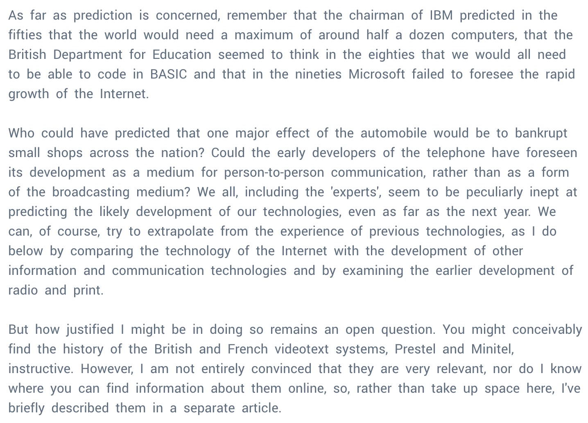
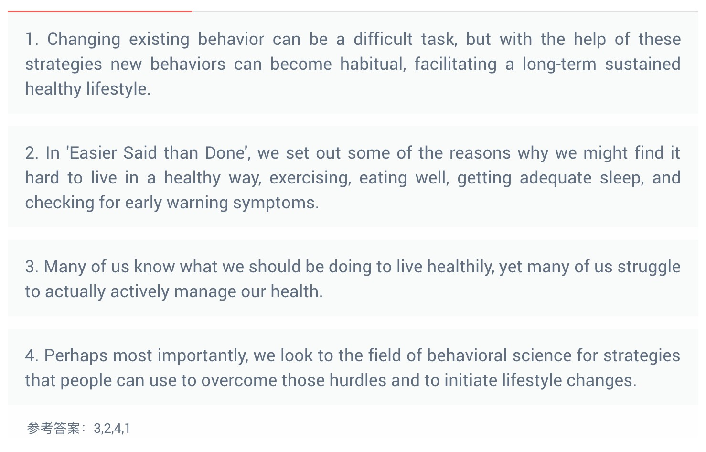
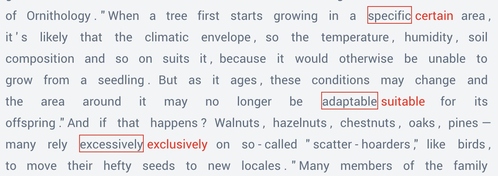

# 为什么我更推荐 PTE 考试

[PTE](https://pearsonpte.com/) 学术考试是于 2009 年 10 月 26 日推出的新一代的国际性英语水平测试，由金融时报的母公司英国培生集团以及 GMAT 的开发机构管理专业研究生入学考试委员（GMAC）共同研究主办。

它听说读写完全机考，打分也由计算机完成。题型非常多，交叉打分，相比之下，抛开应试技巧，我认为它更能体现一个人真正的英语水平，而它的题型对应的训练方式也是非常好的学习英语的方式。

## 常见题型设置

下面介绍一下 PTE 考试主要的题型以及为什么说它是很合理的。由于篇幅限制，我不会一一介绍完所有题型，因为 PTE 有 20 种题型，我只介绍与其他考试不同且非常合理的题型。

### Speaking

下面是口语部分的题型，PTE 评分会通过语音识别以及声波、节奏对比老外发音的方式来判定你的口语能力和得分。

#### [Read aloud](https://pearsonpte.com/the-test/format/english-speaking-writing/read-aloud/)

这个题型是给你一段英文文本，按照文本长度会先有 25s - 40s 时间准备，再给你 30s - 40s 的时间朗读并录音。

看似很简单，不就是照着读嘛，但其实很能看出一个人实力：

* **你需要清楚几乎每个单词的发音，** 否则你肯定会卡顿，读错单词肯定是扣分的，卡顿多了会掉流利度的分。
* **你要有和老外一样的韵律和声调变化、重音以及意群停顿。** 这里完全模拟日常交流，并不是一口气快速读完就是好的，因为日常交流会用声调、重音以及停顿来突出重点，方便理解。
* 要实现正确的意群停顿和重音，这 **要求你在准备期间迅速理解整段文本想要表达的意思** ，否则你根本无法停顿，只能一个一个单词蹦出来。

关于意群可以举一个很简单的例子，就是带 `and` 的句子停顿。比如这一句：`I have an apple and he has an orange.`，当你在读这个句子时，应该在 `and` 前面停顿分成 `I have an apple` 和 `he has an orange`，因为这个句子本身表达的意思是我拥有的水果和他拥有水果的对比。但是这一句：`She is a beautiful and smart girl.` 则应该在 `is` 部分稍微停顿，并在后面加重 `a beautiful and smart girl` 因为这句话要强调的重点是她是一个什么样的女孩。如果你读成了 `She is a beautiful` 和 `and smart girl`，就相当于一个人对你说：`你是一个美...丽的女孩` 一样怪异。

当然，在考试的材料中，不会有上面这么简单的句子。所以训练 RA 就需要：

* 补充你的语料库，大量纠音训练
* 影子跟读和升降调、韵律、意群切割训练

由于它还考察了你的阅读理解能力，所以**这道题做对了不仅仅给 Speaking 加分，还会给 Reading 加分。**

#### [Repeat sentence](https://pearsonpte.com/the-test/format/english-speaking-writing/repeat-sentence/)

这个题型是给你播放一段 3s - 9s 的真人、真场景录制的句子（可能是印度人，可能在户外，可能是大叫，也可能是低声细语），然后立刻让你复述这个句子。 **这个题型模拟日常对话，检测你是否可以迅速理解对方说的内容。**

也可以说是相当难了。通常 4s 以内的声音，你通过大脑瞬间记忆就可以复述发出来，但是 **超过 4s 的声音，你必须通过理解去记忆** 。这道题也是可以看出一个人真实力，如果一句话有一个生词、一个省略发音或者一个口音让你无法听出来，你就很难很流畅的复述这个句子，因为 **你需要理解这个句子的内容并记住** 。单纯记住还不行，还要说出来，在训练过程中经常发现能听懂说的时候说不出来，或者说着说着忘了，这都说明你还不是很熟悉这种表达方式或者这个句子内容。

如果是中文，再长的句子你都能很轻松的复述出大部分内容，因为你非常理解它说了什么，哪怕词语有所替换也能重新表达出来。

这题目训练了你的 听力识别器、理解器 和 口语表达器，简单又有效。所以 **这道题做对了，不仅仅会给 Speaking 加分，还会给 Listening 加分。**

#### [Re-tell lecture](https://pearsonpte.com/the-test/format/english-speaking-writing/re-tell-lecture/)

这个题型是给你播放一段 90s 以内的讲座语音，可以做笔记，之后让你在 40s 的时间内用自己的语言口述总结刚才听到的内容。

由于 PTE 是学术考试，这个题型通常是采集老师上课围绕某一个主题的介绍语音或者是科普类知识，整个录音可能会停顿、结巴或者有嘈杂的背景音，完全像是在上课一样。你需要抓住关键词和逻辑并记录下来，边听边记笔记通常会分心错失一些知识点。语音播放完成之后，会给你 10s 时间准备，让你口述复述刚刚听到的内容。

这个题我认为是最难的题型之一， **首先你需要听出表达的关键意思和逻辑，并且记录下来，之后还要自己组织语句口述出来。** PTE 会通过语音识别你口述的句子中的关键词和逻辑词，来判断你是否听懂了刚刚的文章内容。

对于英语差的人，复述出来的可能只有一些很简单的词语，可能是举例或者套话中的，复述不出实际内容。稍微好一点的可能抓住一些关键词、名词，复述时复述出部分关键词。英语好的可以有效筛除举例或者套话，只抓住关键结论，还可以逻辑化、结构化的总结复述内容。

所以这个题型训练了 听力识别器、英语思维 和 口语表达器，对理解能力、转述能力要求非常高，也是 **同时给 Speaking 和 Listening 加分** 。

#### [Answer short question](https://pearsonpte.com/the-test/format/english-speaking-writing/answer-short-question/)

这个题目会给你一个 3s - 9s 很简短的问题，然后让你快速回答。比如问你：`六角形的螺丝钉有几个边？哪个单词更书面一点，是 感谢 还是 谢啦？`

主要考察你的词汇量，其次就是逻辑能力和理解能力。

### Writing

#### [Summarize written text](https://pearsonpte.com/the-test/format/english-speaking-writing/summarize-written-text/)

这个题目会给你一段不超过 300 词的文章，要求你在 10mins 内将其 **浓缩写一个总结，必须只能用一句话而且不能超过 75 个词。**

**考察很明显，先看你对文章的理解，其次就是转述、总结的思维能力，然后还有语法。** 如果你无法看懂文章表达的大意，基本没法转述总结。如果大体看懂了，可能写出来的会漏掉一些关键点。如果非常懂，可能写出简洁明了又准确的概述。

训练时，有道机经题是这样的：

大意就是 IBM 对未来的一些预测、预测的结果并不是很对，我们可以从过去找一些经验照搬过来但是不一定对。所以我给出的答案：

`Although we can try to extrapolate from the experience of previous technologies, we all seem to be peculiarly inept at predicting the likely development of our technologies.`

之后翻看讨论区，Writing 88 分（满分 90）大神的答案让我虎躯一震：

`The trend of technology is unpredictable.`

整篇文章不就是要表达这一个核心关键思想么，简单明了准确，没废话。。。我们的水平差距高下立见。

### Reading

#### [Re-order paragraphs](https://pearsonpte.com/the-test/format/english-reading/re-order-paragraphs/)

这个题目会给你 150 个词的文本，将其句子打乱让你重新排序恢复原样。是一个非常有意思的题目。比如下面这个机经题：

做这个题也是非常难的，你需要读懂每句话的意思，再思考它是一个总结句还是概览句，用于引导还是举例描述，有没有代指关系和依赖。非常考验阅读理解和英语思维。有种侦探的感觉。

这个题目打分是按照上下语句配对，比如正确答案是 53214 如果你的答案是 21435 那么其中 214 有两个配对得 2 两分，如果全对则是 4 + 1（全对分）= 5 分。这个题目 **主要训练你的阅读理解能力和英文思维逻辑。**

### Listening

#### [Summarize spoken text](https://pearsonpte.com/the-test/format/english-listening/summarize-spoken-text/)

这个题目会给你播放一段 60s - 90s 的听力，给你 10mins 时间让你写一段 50 - 70 个词的总结。

也是模拟日常上课，类似上面 Re-tell lecture 题型，但是考察点不一样。同样是边听边记笔记，这道题目要求了你要写 50 词以上的内容，要求你要记录一定量的信息，否则根本写不出这么多内容。这要求你有一定单词量、语法知识、理解能力和笔记能力，所以我觉得也是最难的题型之一。

**这道题会同时给 Listening 和 Writing 加分。**

#### [Highlight incorrect words](https://pearsonpte.com/the-test/format/english-listening/highlight-incorrect-words/)

这个题目算是 PTE 最轻松的题目，会给你一段文本同时播放语音，让你跟着语音看文本，发现语音跟文本实际单词不对的时候，标记下这个单词读错了。

其实这个挺考验对单词本身的掌握，首先语音是日常语速，可能忽快忽慢、重复停顿，也可能是不同口音或者背景有噪音。这要求你注意力集中要跟上节奏，其次眼睛看单词就要马上知道这个单词的发音。比如上面 `excessively` 和 `exclusively` 形状非常接近，如果你对这两个单词掌握不好，很有可能只看到了 `ex` 和 `sively` 并听到类似发音就认为是对的跳过了。

**这个锻炼你的 视力识别器 和 语料库。**

#### [Write from dictation](https://pearsonpte.com/the-test/format/english-listening/write-from-dictation/)

这个题目类似 Repeat Sentence 会播放一段 3s - 5s 的音频，然后让你写下来。写对一个单词（哪怕是 a、the）都会得一分。

其实这个就是 **类似精听，考验你的听力识别和语料库容量。**

## 打分规则

从上面可以看出，不同于雅思中听力部分就是听力分数、写作部分就是写作分数，PTE 是跨题型加分。比如 Read aloud 题目，想要读的好，的确先要看懂文章，看懂文章代表你的 Reading 能力也很高，所以会同时给 Speaking 和 Reading 加分。

这种方式和题目设计显然是更加合理的。

## 备考优势

看完是不是会觉得 PTE 考试实在是太难了？但是从备考而言，PTE 目前有很多备考技巧：

1. 首先它是机考，这意味着它的背后是人工智能、是程序。所以我们可以用模版来让我们回答更顺畅。而雅思如果是考官阅卷，会很容易发现你套用了模版。
2. 其次每个考生每次考试试题都不一样，都是从题库中抽取组合而成，这样就存在一个机经库。考生可以在考过之后回忆考题方便其他同学备考。不同于雅思每次统一出新题，PTE 的机经命中率会稍高，但是也在不停的扩充、更新使其几率降低。**当然备考策略不能是背机经，而应该是用机经来当作真题训练**，这样更接近真实考试一些。
3. 约考简单，出分速度快。在国内基本随时可以预定考试，因为是机器阅卷，第二天早上就出成绩了，如果不行可以马上约下一次考试。相比雅思，需要等十天以上才可以查询成绩。这十天会等的非常焦虑。

所以我最终决定从备考雅思换成了 PTE。不过还需要注意，留学的学校和国家对英语成绩的认定有要求，不是所有学校都认可 PTE 成绩作为你的英语水平，这一点要提前查好。